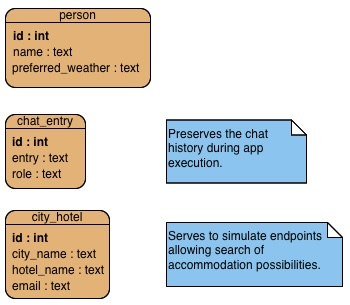
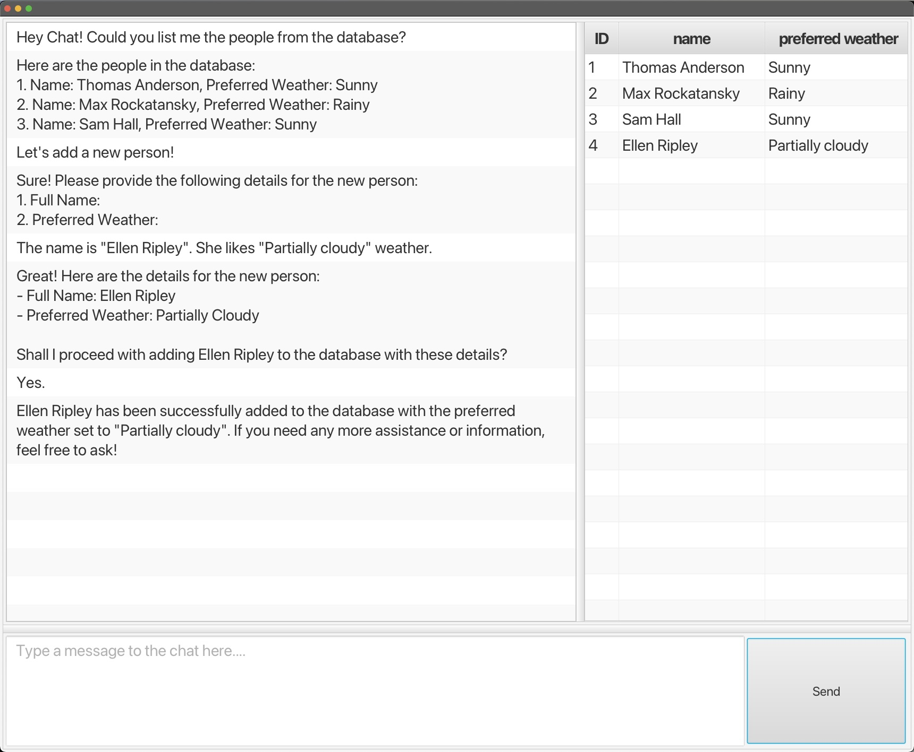
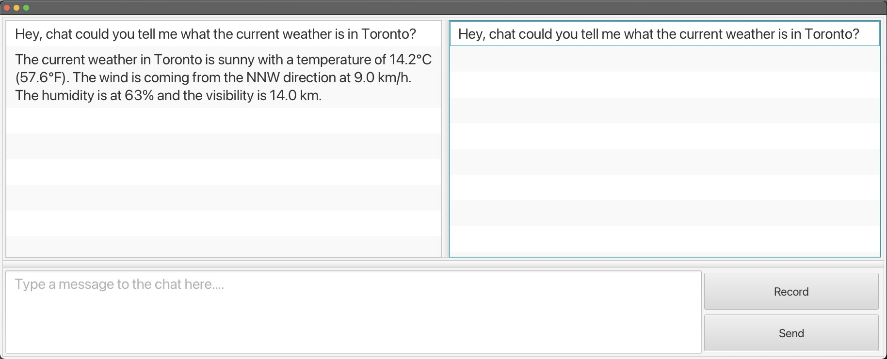

# Semantic Kernel & Spring Function Calling: AI assistant suited to your needs is now easier than ever.
Artificial Intelligence (AI) is doing an upheaval in the technology world. From its first appearance, it has evolved from simplistic algorithms and rule-based systems, to services generating poetry, composing music, and even assisting in complex problem-solving. Some time ago we've witnessed a rise of conversational agents like ChatGPT. Such agents gained a lot of interest and were / are integrated with existing services, automating many areas of interaction with software. These breakthroughs are paving the way for even more sophisticated applications, promising a future where AI seamlessly integrates into various aspects of our lives. And we can boldly say - the future is now.

**What brings the future to the present?**

New AI tools emerge as the AI technology advances. Some of them provide so simple, yet so significant thing like quality of life improvements for developers. One such tool is **Semantic Kernel**, [a development kit created by Microsoft](https://learn.microsoft.com/en-us/semantic-kernel/overview/), designed to facilitate seamless integration between AI models and code. Similarly, **Spring Function Calling** — [offered by the **Spring AI** module](https://docs.spring.io/spring-ai/reference/api/chat/functions/openai-chat-functions.html) — provides a comparable approach, enabling developers to build and manage AI-driven Spring services with ease. Both Semantic Kernel and Spring AI Function Calling represent a set of tools that simplifies harnessing AI's potential, each with its own unique strengths and features. 

**We've already seen many bold claims of this kind, yet almost none of them seemed to change our lives that much. What makes you think this time it would be different?**

While it's true that many technological advancements have promised to be game-changers, Semantic Kernel and Spring Function Calling stand out by providing an easy way to integrate AI services with minimal setup effort. These frameworks simplify the connection between AI models and existing codebases. This means AI functionalities are more accessible (whether it's chat completion, audio transcription or image generation). Developers can quickly set up AI agents within their systems with next to no effort. And, in case someone would prefer not to rely on corporate models, one has the possibility to use locally hosted models. Both tools come with vendor assurances of being future-proof and offer operations chaining, what allows for more complex and sophisticated AI-driven workflows.

To put this into perspective, let's take a look at concrete examples with a [demo app](https://github.com/ddzikon/semantic-kernel-demo).  
The app has a simple GUI and lend itself to interactions with OpenAI's ChatGPT. It has also a simple, in-memory database.  
The data model is as follows:  


First demo use case of Semantic Kernel and Spring AI Function Calling allows database manipulation through chat prompts.
Second one integrates external [Weather API](https://www.weatherapi.com/) enabling ChatGPT to provide current weather information at given location. 
Third use case simulates search of accommodation information in a city (as an example of operations chaining, we'll jump to it later).

  
_Demo app. Left panel is chat history, right panel contains person table entries._

**Shall we dive deeper into the nuts and bolts? What's the magic behind the scenes (pun intended)?**

Absolutely! Let's see how these tools are easy in use.
Both tools work on a similar concept of AI agents (although only in case of Semantic Kernel this exact term is used).  
First we have to create a wrapper for stuff we'd like to call. A Plugin in Semantic Kernel's terminology, or a function according to Spring AI docs' recommendations:
<table>
<tr>
<td>
Semantic Kernel

```java
class WeatherPlugin {

    private final WeatherClient weatherClient;
    
    public WeatherPlugin(WeatherClient weatherClient) {
        this.weatherClient = weatherClient;
    }

    // 1
    @DefineKernelFunction(
            name = "getCurrentWeather",
            description = "Get / fetch info about current weather at given location.",
            returnType = "string"
    )
    public String getCurrentWeather(
            // 2
            @KernelFunctionParameter(name = "location", description = "Name of a place / location") String location
    ) {
        return weatherClient.getCurrent(location);
    }
}
```

1. `@DefineKernelFunction` annotation provides a description of the method to a model, explaining what the method does and what expected result could be.
2. `@KernelFunctionParameter` annotation describes the parameters, so a model can extract it from a prompt and pass to the method.
</td>
<td>
Spring AI
                
```java
class WeatherFunction implements Function<WeatherFunction.Request, WeatherFunction.Response> {

    public static final String FUNCTION_NAME = "currentWeather";
    
    // 1
    public record Request(String location) {}
    public record Response(String output) {}
    
    private final WeatherClient weatherClient;
    
    public WeatherFunction(WeatherClient weatherClient) {
        this.weatherClient = weatherClient;
    }

    @Override
    public Response apply(Request request) {
        final var weatherResponse = weatherClient.getCurrent(request.location);

        return new Response(weatherResponse);
    }
}
```

// TODO confirm it
1. Unfortunately, Spring's `FunctionCallbackWrapper` exposing the function to the model operates on wrappers of simple types, hence `Request` and `Response` records were created.
</td>
</tr>
</table>

Having the code wrapped by tool's respective components it is time to make it callable by chat services.  
This means passing the plugin / function to respective configuration objects.

<table>
<tr>
<td>
Semantic Kernel

```java
class ChatServiceWithFunctions {

    private final ChatCompletionService chatCompletionService;
    private final InvocationContext invocationContext;
    private final Kernel kernel;

    public ChatServiceWithFunctions(
            OpenAIAsyncClient openAIAsyncClient, 
            WeatherPlugin weatherPlugin
    ) {
        // 1
        this.chatCompletionService = ChatCompletionService.builder()
                .withModelId("gpt-3.5-turbo")
                .withOpenAIAsyncClient(openAIAsyncClient)
                .build();

        // 2
        this.invocationContext = InvocationContext.builder()
                .withToolCallBehavior(ToolCallBehavior.allowAllKernelFunctions(true))
                .build();

        // 3
        KernelPlugin kernelWeatherPlugin = KernelPluginFactory.createFromObject(weatherPlugin, "weatherPlugin");

        // 4
        this.kernel = Kernel.builder()
                .withAIService(ChatCompletionService.class, chatCompletionService)
                .withPlugin(kernelWeatherPlugin)
                .build();
    }

    public ChatMessageContent interact(ChatHistory chatHistory) {
        // 5
        List<ChatMessageContent<?>> conversation = chatCompletionService.getChatMessageContentsAsync(
                chatHistory,
                kernel,
                invocationContext
        ).block();

        return conversation.getLast();
    }
}
```
1. `ChatCompletionService` is a main object allowing interactions with the chat, it also holds configuration related to model version and API keys.
2. `InvocationContext` enables use of kernel functions, meaning chat will be able to call the code.
3. `KernelPlugin` is a plugin object for Semantic Kernel that holds information about callable methods.
4. `Kernel` contains Semantic Kernel state. // TODO add details
5. Interactions with chat happen with use of `ChatCompletionService`. Chat knows about available functions through passed `Kernel` object. Current prompt is sent together with whole `ChatHistory`, so the chat knows the conversation context.
</td>
<td>
Spring AI 

```java
@Configuration
class OpenAiConfigurationProvider {

    // [...]
    
    // 1
    @Bean
    @Autowired
    OpenAiChatOptions openAiChatOptions(WeatherFunction weatherFunction) {
        return OpenAiChatOptions.builder()
                .withModel("gpt-3.5-turbo")
                .withFunction(WeatherFunction.FUNCTION_NAME)
                .withFunctionCallbacks(List.of(
                                new FunctionCallbackWrapper.Builder<>(weatherFunction)
                                        .withName(WeatherFunction.FUNCTION_NAME)
                                        .withDescription("Get the current weather in location")
                                        .build()
                        )
                )
                .build();
    }

    // [...]
}

@Component
@RequiredArgsConstructor(onConstructor = @__(@Autowired))
public class ChatService {

    private final OpenAiApi openAiApi;
    private final OpenAiChatOptions openAiChatOptions;

    public Message askGpt(List<Message> messages) {
        // 2
        ChatModel chatModel = new OpenAiChatModel(openAiApi, openAiChatOptions);

        // 3
        return chatModel.call(new Prompt(messages)).getResult().getOutput();
    }
}
```

1. `OpenAiChatOptions` object that holds the information about callable functions. It can be created as a Spring Bean.
2. `ChatModel` object that is responsible for interactions with AI chat completion service.
3. `Prompt` with list of `Message` objects corresponds to chat history (list of messages contains also the newest prompt). Passing whole conversation to the chat preserves the conversation context with each chat call. Thanks to it the chat can reason based on previous inquiries.
</td>
</tr>
</table>

And that's it! The agents are ready to serve.

**Somewhere at the beginning _operations chaining_ was mentioned. Are those tools really able to execute tasks consisting of multiple steps?**

Definitely. I've checked it with rather absurd example, but it utilized the Semantic Kernel's potential. Let's take a look at that conversation with the chat:  

> USER: 
> Hey Chat!   
> 
> CHAT: Hello! How can I assist you today?  
> 
> USER: The people I have data about in my database would like to go on a trip today. They consider three cities: Madrid, Oslo, Warsaw. Could you help them choose a destination best for most of them? Also, find a hotel in that city and write an email asking about price for one night stay.  
> 
> CHAT: Here are the current weather conditions in the three cities considered by your group:  
> 1. Madrid:  
>   - Temperature: 19.3°C, Partly cloudy  
>   - Wind: 15.1 km/h from the North  
>   - Humidity: 94%  
> 2. Oslo:  
>   - Temperature: 13.2°C, Partly cloudy  
>   - Wind: 31.0 km/h from the Southwest  
>   - Humidity: 94%  
> 3. Warsaw:  
>   - Temperature: 24.1°C, Sunny  
>   - Wind: 9.0 km/h from the East-Southeast  
>   - Humidity: 69%  
> 
> Based on the preferred weather of the individuals:  
> - Thomas Anderson and Sam Hall prefer sunny weather.  
> - Max Rockatansky prefers rainy weather.  
> 
> Considering the weather preferences, Warsaw seems to be the best choice as it has sunny weather which is preferred by two individuals. Would you like to proceed with choosing Warsaw as the destination? If so, I can find a hotel in Warsaw and send an email requesting the price for a one-night stay.  
> 
> USER: Warsaw sounds great!  
> 
> CHAT: I have found a hotel in Warsaw called "Neat Hotel" with the email address neat@hotel.pl.  
> 
> Next, I will draft an email to inquire about the price for a one-night stay at the Neat Hotel. Here is the draft of the email:  
> ```  
> Subject: Inquiry About One-Night Stay Price  
> 
> Dear Neat Hotel,  
> 
> I hope this message finds you well. We are planning a trip to Warsaw and are interested in staying at your hotel for one night. Could you please provide information about the price for a one-night stay for our group?  
> 
> Looking forward to your prompt response.  
> 
> Best regards,  
> [Your Name]  
> ```  
> 
> Would you like me to send this email to enquire about the price for a one-night stay at the Neat Hotel in Warsaw?  
> 
> USER: Sign the email as Thomas Anderson and send it.  
> 
> CHAT: The email has been sent to Neat Hotel in Warsaw on behalf of Thomas Anderson. They should get back to you soon with information about the price for a one-night stay.  
> 
> If you need any further assistance or have any other requests, feel free to let me know!  

This conversation is a result of single prompt - a question about advice regarding trip destination. Semantic Kernel and chat were able to [plan](https://learn.microsoft.com/en-us/semantic-kernel/concepts/planning?pivots=programming-language-java) the steps, execute them and adjust the actions to the user's instructions along the way.  
When we take a look at the demo app logs produced during the conversation, we'll notice the required functions were called automatically.  
<details>
<summary>demo app logs</summary>

// TODO perhaps it would be best to add more crlfs and colour significant parts
```
09:27:48.761 [JavaFX Application Thread] INFO  org.example.view.ViewController - Send button clicked, message: 
Hey Chat!
09:27:48.780 [JavaFX Application Thread] INFO  org.example.agent.OpenAIAgent - Sending message, waiting for response...
09:27:50.017 [JavaFX Application Thread] INFO  org.example.agent.OpenAIAgent - Response received:
Hello! How can I assist you today?
09:28:09.282 [JavaFX Application Thread] INFO  org.example.view.ViewController - Send button clicked, message: 
The people I have data about in my database would like to go on a trip today. They consider three cities: Madrid, Oslo, Warsaw. Could you help them choose a destination best for most of them? Also, find a hotel in that city and write an email asking about price for one night stay.
09:28:09.286 [JavaFX Application Thread] INFO  org.example.agent.OpenAIAgent - Sending message, waiting for response...
09:28:10.041 [boundedElastic-1] INFO  org.example.agent.PersonPlugin - getAllPeople called
09:28:11.493 [boundedElastic-1] INFO  org.example.agent.WeatherPlugin - getCurrentWeather called with argument: location = Madrid
09:28:11.493 [boundedElastic-1] INFO  org.example.agent.WeatherClient - Requesting weather for location Madrid...
09:28:11.670 [boundedElastic-1] INFO  org.example.agent.WeatherClient - Current weather for location Madrid:
{"location":{"name":"Madrid","region":"Madrid","country":"Spain","lat":40.4,"lon":-3.68,"tz_id":"Europe/Madrid","localtime_epoch":1724916334,"localtime":"2024-08-29 09:25"},"current":{"last_updated_epoch":1724915700,"last_updated":"2024-08-29 09:15","temp_c":19.3,"temp_f":66.7,"is_day":1,"condition":{"text":"Partly cloudy","icon":"//cdn.weatherapi.com/weather/64x64/day/116.png","code":1003},"wind_mph":9.4,"wind_kph":15.1,"wind_degree":360,"wind_dir":"N","pressure_mb":1018.0,"pressure_in":30.06,"precip_mm":0.0,"precip_in":0.0,"humidity":94,"cloud":50,"feelslike_c":19.3,"feelslike_f":66.7,"windchill_c":24.8,"windchill_f":76.6,"heatindex_c":25.8,"heatindex_f":78.5,"dewpoint_c":15.0,"dewpoint_f":58.9,"vis_km":10.0,"vis_miles":6.0,"uv":6.0,"gust_mph":13.9,"gust_kph":22.3}}
09:28:11.672 [boundedElastic-2] INFO  org.example.agent.WeatherPlugin - getCurrentWeather called with argument: location = Oslo
09:28:11.672 [boundedElastic-2] INFO  org.example.agent.WeatherClient - Requesting weather for location Oslo...
09:28:11.720 [boundedElastic-2] INFO  org.example.agent.WeatherClient - Current weather for location Oslo:
{"location":{"name":"Oslo","region":"Oslo","country":"Norway","lat":59.92,"lon":10.75,"tz_id":"Europe/Oslo","localtime_epoch":1724916334,"localtime":"2024-08-29 09:25"},"current":{"last_updated_epoch":1724915700,"last_updated":"2024-08-29 09:15","temp_c":13.2,"temp_f":55.8,"is_day":1,"condition":{"text":"Partly cloudy","icon":"//cdn.weatherapi.com/weather/64x64/day/116.png","code":1003},"wind_mph":19.2,"wind_kph":31.0,"wind_degree":230,"wind_dir":"SW","pressure_mb":1005.0,"pressure_in":29.68,"precip_mm":0.0,"precip_in":0.0,"humidity":94,"cloud":75,"feelslike_c":13.7,"feelslike_f":56.6,"windchill_c":12.1,"windchill_f":53.7,"heatindex_c":11.8,"heatindex_f":53.2,"dewpoint_c":8.9,"dewpoint_f":48.0,"vis_km":10.0,"vis_miles":6.0,"uv":3.0,"gust_mph":23.7,"gust_kph":38.2}}
09:28:11.721 [boundedElastic-1] INFO  org.example.agent.WeatherPlugin - getCurrentWeather called with argument: location = Warsaw
09:28:11.721 [boundedElastic-1] INFO  org.example.agent.WeatherClient - Requesting weather for location Warsaw...
09:28:11.766 [boundedElastic-1] INFO  org.example.agent.WeatherClient - Current weather for location Warsaw:
{"location":{"name":"Warsaw","region":"","country":"Poland","lat":52.25,"lon":21.0,"tz_id":"Europe/Warsaw","localtime_epoch":1724916335,"localtime":"2024-08-29 09:25"},"current":{"last_updated_epoch":1724915700,"last_updated":"2024-08-29 09:15","temp_c":24.1,"temp_f":75.4,"is_day":1,"condition":{"text":"Sunny","icon":"//cdn.weatherapi.com/weather/64x64/day/113.png","code":1000},"wind_mph":5.6,"wind_kph":9.0,"wind_degree":120,"wind_dir":"ESE","pressure_mb":1021.0,"pressure_in":30.15,"precip_mm":0.0,"precip_in":0.0,"humidity":69,"cloud":0,"feelslike_c":24.8,"feelslike_f":76.7,"windchill_c":27.9,"windchill_f":82.3,"heatindex_c":27.8,"heatindex_f":82.0,"dewpoint_c":13.0,"dewpoint_f":55.4,"vis_km":10.0,"vis_miles":6.0,"uv":7.0,"gust_mph":6.7,"gust_kph":10.8}}
09:28:15.243 [JavaFX Application Thread] INFO  org.example.agent.OpenAIAgent - Response received:
Here are the current weather conditions in the three cities considered by your group:
1. Madrid:
   - Temperature: 19.3°C, Partly cloudy
   - Wind: 15.1 km/h from the North
   - Humidity: 94%
2. Oslo:
   - Temperature: 13.2°C, Partly cloudy
   - Wind: 31.0 km/h from the Southwest
   - Humidity: 94%
3. Warsaw:
   - Temperature: 24.1°C, Sunny
   - Wind: 9.0 km/h from the East-Southeast
   - Humidity: 69%

Based on the preferred weather of the individuals:
- Thomas Anderson and Sam Hall prefer sunny weather.
- Max Rockatansky prefers rainy weather.

Considering the weather preferences, Warsaw seems to be the best choice as it has sunny weather which is preferred by two individuals. Would you like to proceed with choosing Warsaw as the destination? If so, I can find a hotel in Warsaw and send an email requesting the price for a one-night stay.
09:28:43.461 [JavaFX Application Thread] INFO  org.example.view.ViewController - Send button clicked, message: 
Warsaw sounds great!
09:28:43.469 [JavaFX Application Thread] INFO  org.example.agent.OpenAIAgent - Sending message, waiting for response...
09:28:44.428 [boundedElastic-1] INFO  o.example.agent.AccommodationPlugin - findHotelInCity called with cityName: Warsaw
09:28:45.454 [boundedElastic-1] INFO  o.example.agent.AccommodationPlugin - getHotelEmailAddress called with hotelName: Neat Hotel
09:28:48.159 [JavaFX Application Thread] INFO  org.example.agent.OpenAIAgent - Response received:
  have found a hotel in Warsaw called "Neat Hotel" with the email address neat@hotel.pl.

Next, I will draft an email to inquire about the price for a one-night stay at the Neat Hotel. Here is the draft of the email:

Subject: Inquiry About One-Night Stay Price

Dear Neat Hotel,

I hope this message finds you well. We are planning a trip to Warsaw and are interested in staying at your hotel for one night. Could you please provide information about the price for a one-night stay for our group?

Looking forward to your prompt response.

Best regards,
[Your Name]


Would you like me to send this email to enquire about the price for a one-night stay at the Neat Hotel in Warsaw?
09:29:30.406 [JavaFX Application Thread] INFO  org.example.view.ViewController - Send button clicked, message: 
Sign the email as Thomas Anderson and send it.
09:29:30.412 [JavaFX Application Thread] INFO  org.example.agent.OpenAIAgent - Sending message, waiting for response...
09:29:32.356 [boundedElastic-1] INFO  o.example.agent.AccommodationPlugin - sendEmail called with email: neat@hotel.pl
message: Subject: Inquiry About One-Night Stay Price

Dear Neat Hotel,

I hope this message finds you well. We are planning a trip to Warsaw and are interested in staying at your hotel for one night. Could you please provide information about the price for a one-night stay for our group?

Looking forward to your prompt response.

Best regards,
Thomas Anderson
09:29:33.672 [JavaFX Application Thread] INFO  org.example.agent.OpenAIAgent - Response received:
The email has been sent to Neat Hotel in Warsaw on behalf of Thomas Anderson. They should get back to you soon with information about the price for a one-night stay.

If you need any further assistance or have any other requests, feel free to let me know!
```

</details>

**If only it could respond to voice commands... one could prepare oneself an AI voice assistant.**

Well, it just so happens that's entirely possible! At least in case of Spring AI. The Java library of Semantic Kernel does not support audio models yet. This gap is for now filled by Spring AI.  

In fact, one of the demo app's features showcases this capability. The demo subproject exploring the possibilities of Spring AI Function Calling utilizes audio transcription model to recognize user's voice input. Transcribed text is later passed to the chat completion service. With the right setup, this could very well serve as the foundation for an AI voice assistant, blending voice recognition with intelligent responses.  

  
_Left pane contains text chat history, right pane contains responses from audio transcription model. Press **Record** button, ask a question, press **Stop** and the app will send transcribed audio to the text chat completion service_.  

**What's the takeaway from all these details?**

The essence of the technical details reveals a broader impact: how such tools are reshaping the developer experience. Integrating AI with code is more accessible and streamlined. Both mentioned earlier libraries provide structured ways to wrap your code and make it callable by AI models. Embedding an AI-driven functionalities into an application requires minimal effort.  

These tools also open up new possibilities for innovation in software development. AI isn't just an add-on, it becomes an integral part of an application, making it more intelligent and ensuring that it can evolve with minimal friction. 

Moreover, AI models gain real time processing capabilities. Each model is trained on data gathered to a certain moment in time. Thanks to these tools one can bind real time data sources to a model. With each inquiry model can reach this data and adjust its response accordingly to incoming pieces of information.
Considering also the operation chaining, these tools pave the path to movie-like AI assistants.

In short, the takeaway here is that these aren’t just theoretical advancements — they are ready-to-use tools that can ease the way developers approach AI, making it a seamless experience.

**Were there any surprises you encountered while building the demo app using these tools?**

Certainly! Tinkering with a new technology always is often full of surprises.  

// TODO confirm whether it's chat or library  
The most interesting in my opinion was ability to autocorrect parameters passed to function. I've encountered it when I was experimenting with Semantic Kernel.
I asked chat _What's the current weather in Wrocław?_, where the city name _Wrocław_ contains polish letter **ł**. 
Let's take a look at logs from that event:  
```shell
10:32:34.097 [JavaFX Application Thread] INFO  org.example.view.ViewController - Send button clicked, message: Hey Chat! What is the current weather in Wrocław?
10:32:34.097 [JavaFX Application Thread] INFO  org.example.agent.OpenAIAgent - Generating message for the chat: Hey Chat! What is the current weather in Wrocław?
10:32:34.116 [JavaFX Application Thread] INFO  org.example.agent.OpenAIAgent - Sending message, waiting for response...
10:32:35.844 [boundedElastic-1] INFO  org.example.agent.WeatherPlugin - getCurrentWeather called with argument: location = Wrocław
10:32:35.844 [boundedElastic-1] INFO  org.example.agent.WeatherClient - Requesting weather for location Wrocław...
10:32:36.083 [boundedElastic-1] INFO  org.example.agent.WeatherClient - Current weather for location Wrocław:
{"error":{"code":1006,"message":"No matching location found."}}
10:32:37.080 [boundedElastic-1] INFO  org.example.agent.WeatherPlugin - getCurrentWeather called with argument: location = Wroclaw
10:32:37.080 [boundedElastic-1] INFO  org.example.agent.WeatherClient - Requesting weather for location Wroclaw...
10:32:37.163 [boundedElastic-1] INFO  org.example.agent.WeatherClient - Current weather for location Wroclaw:
{"location":{"name":"Wroclaw","region":"","country":"Poland","lat":51.1,"lon":17.03,"tz_id":"Europe/Warsaw","localtime_epoch":1724661047,"localtime":"2024-08-26 10:30"},"current":{"last_updated_epoch":1724661000,"last_updated":"2024-08-26 10:30","temp_c":18.4,"temp_f":65.1,"is_day":1,"condition":{"text":"Partly cloudy","icon":"//cdn.weatherapi.com/weather/64x64/day/116.png","code":1003},"wind_mph":5.6,"wind_kph":9.0,"wind_degree":70,"wind_dir":"ENE","pressure_mb":1023.0,"pressure_in":30.21,"precip_mm":0.0,"precip_in":0.0,"humidity":83,"cloud":50,"feelslike_c":18.4,"feelslike_f":65.1,"windchill_c":19.5,"windchill_f":67.1,"heatindex_c":19.5,"heatindex_f":67.1,"dewpoint_c":12.5,"dewpoint_f":54.5,"vis_km":10.0,"vis_miles":6.0,"uv":5.0,"gust_mph":6.4,"gust_kph":10.2}}
```
The Weather API didn't recognize the city name with polish letters and returned an erroneous response. Chat could pass it back to the app, but instead it decided to request the data again with a city name without polish letters - __Wroclaw__ - and it worked.  
I've repeated the prompt for Spring AI Function Calling demo app, however in this case it didn't handle it well and returned the error response.

Another example would be asking a follow-up question in case of doubt or lacking data.  
The demo app allows manipulating a simple `Person` table using chat prompts. Inserting a new person requires certain data - a person's `name` and `preferred_weather`. When I asked about inserting a new person without providing the details, chat asked in return about the missing pieces of information. New database entries were created after I clarified it.

**These are rather positive surprises. I guess there were also some inconvenient ones?**  
AI: **Those are great outcomes, but were there any hurdles or challenges that caught you off guard?**

While overall experience was largely positive, a few inconveniences did come up.  

Playing with prompts I noticed the best outcomes give concise, precise inquiries. 
I've spotted a situation when chat being asked a question somewhere around weather but not directly about, tried to call a couple functions multiple times, yet it didn't use the responses to construct an answer.  
This implies two things: 
- amount of function calls can be out of control and if these functions call external APIs it can generate costs,
- random calls of functions that interact with things not being read-only (e.g. data manipulation) may introduce inconsistent state.

**Any potential solutions?**

System messages could come handy here. It is a part of a prompt that tells the chat how to behave. Semantic Kernel documentation even calls it "a persona".  
You've probably noticed that in the attached screenshot of the demo app the chat asks for confirmation before executing a function. This behavior is a result of a following system message:  

`You are helpful assistant. Before calling a function, that manipulates some data, you will ask the user for confirmation and present the parameters you would like to pass to the function.`  

Nonetheless, there is a key takeaway - best results provide system messages that are both concise and precise. It took a few iterations to get this one right. This also highlights the importance of prompt engineering. However, that would take another article to elaborate.

**So, how do all these pieces come together in the bigger picture?**

When we take a look from broader perspective, it seems clear that tools like Semantic Kernel and Spring AI Function Calling are more than just new additions to the developer's toolkit. They represent a shift in how we can integrate AI into everyday applications. These tools reduce the effort to leverage AI capabilities in either new or already existing codebases.  
The seamless integration those tools offer, whether through real-time data processing or the ability to handle complex workflows, marks that AI is nt just an isolated feature - it could become core part of how software operates and interacts with users.  
The AI itself has tremendous potential, however while working with solely it, we encounter similar challenges. These challenges are being constantly addressed and the technology is more and more mature with each day. This means there already are some good practices determined that allow to face the challenges effectively.  
In essence, these advancements bring us closer to a future where AI is not just a buzzword, but a practical, integrated component of software development, transforming how we build, interact with and evolve our applications.
