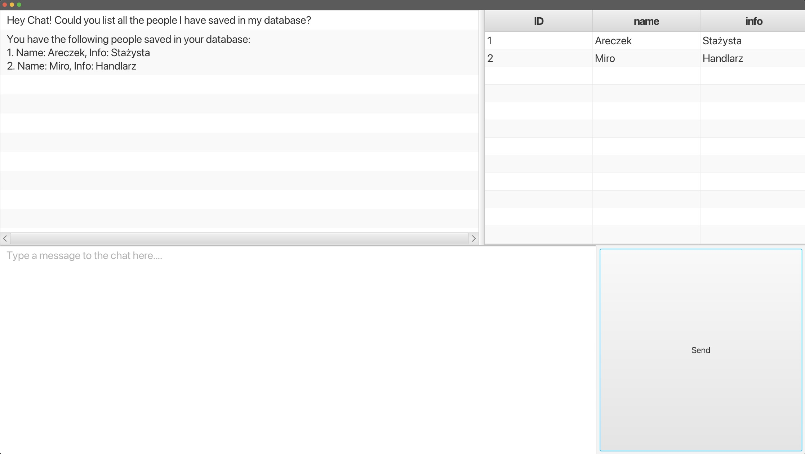
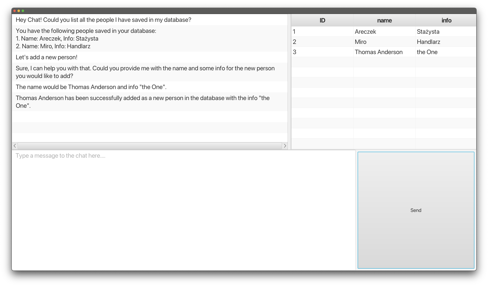
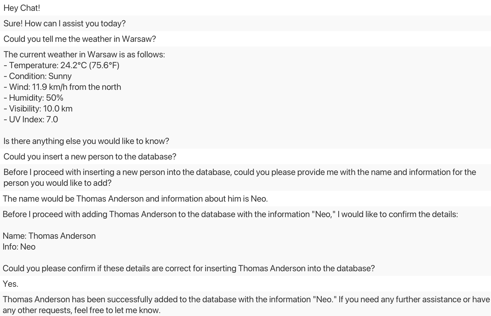

# Semantic Kernel & Spring Function Calling: AI assistant suited to your needs is now easier than ever.
Artificial Intelligence (AI) is doing an upheaval in the technology world. From its first appearance, it has evolved from simplistic algorithms and rule-based systems, to services generating poetry, composing music, and even assisting in complex problem-solving. Some time ago we've witnessed a rise of conversational agents like ChatGPT. Such agents gained a lot of interest and were / are integrated with existing services, automating many areas of interaction with software. These breakthroughs are paving the way for even more sophisticated applications, promising a future where AI seamlessly integrates into various aspects of our lives. And we can boldly say - the future is now.

**What brings the future to the present?**

AI:
As AI technology advances, new tools are emerging to help developers integrate these capabilities into their applications. One such tool is **Semantic Kernel**, [a development kit created by Microsoft](https://learn.microsoft.com/en-us/semantic-kernel/overview/), designed to facilitate seamless integration between AI models and code. Similarly, **Spring Function Calling** — [offered by the **Spring AI** module](https://docs.spring.io/spring-ai/reference/api/chat/functions/openai-chat-functions.html) — provides a comparable approach, enabling developers to build and manage AI-driven services with ease. Both Semantic Kernel and Spring Function Calling represent a new wave of tools that simplify harnessing AI's potential, each with its own unique strengths and features. As we explore these innovations, it’s worth considering how they could transform the way we develop and interact with AI-powered applications.

AI + changes:
New AI tools emerge as the AI technology advances. Some of them provide so simple, yet so significant thing like quality of life improvements for developers. One such tool is **Semantic Kernel**, [a development kit created by Microsoft](https://learn.microsoft.com/en-us/semantic-kernel/overview/), designed to facilitate seamless integration between AI models and code. Similarly, **Spring Function Calling** — [offered by the **Spring AI** module](https://docs.spring.io/spring-ai/reference/api/chat/functions/openai-chat-functions.html) — provides a comparable approach, enabling developers to build and manage AI-driven Spring services with ease. Both Semantic Kernel and Spring AI Function Calling represent a set of tools that simplifies harnessing AI's potential, each with its own unique strengths and features. 

**We've already seen many bold claims of this kind, yet almost none of them seemed to change our lives that much. What makes you think this time it would be different?**

AI:
While it's true that many technological advancements have promised to be game-changers, Semantic Kernel and Spring Function Calling stand out by addressing critical gaps in AI integration with a focus on ease of use and minimal setup effort. These tools offer versatile frameworks that simplify the connection between AI models and existing codebases, making advanced AI functionalities more accessible. Developers can quickly set up AI agents within their systems with next to no effort, and the ability to use locally hosted models provides flexibility for those who prefer not to rely on corporate models. Both tools come with vendor assurances of being future-proof and offer vast possibilities for chaining operations, enabling more complex and sophisticated AI-driven workflows. 

AI + changes:
While it's true that many technological advancements have promised to be game-changers, Semantic Kernel and Spring Function Calling stand out by providing an easy way to integrate AI services with minimal setup effort. These frameworks simplify the connection between AI models and existing codebases. This means AI functionalities are more accessible (whether it's chat completion, audio transcription or image generation). Developers can quickly set up AI agents within their systems with next to no effort. And, in case someone would prefer not to rely on corporate models, one has the possibility to use locally hosted models. Both tools come with vendor assurances of being future-proof and offer operations chaining, what allows for more complex and sophisticated AI-driven workflows.

To put this into perspective, let's take a look at concrete examples with a [demo app]().  
The app has a simple GUI and allows interactions with OpenAI's ChatGPT. It has also a simple, in-memory database.  

First demo use case of Semantic Kernel and Spring AI Function Calling allows database manipulation through chat prompts.
Second one integrates external [Weather API]() enabling ChatGPT to provide current weather information at given location.  

//TODO find a way to add captions





**Shall we dive deeper into the nuts and bolts? What's the magic behind the scenes (pun intended)?**

Absolutely! Let's see how these tools are easy in use.
Both tools work on a similar concept of AI agents (although only in case of Semantic Kernel this exact term is used).  
First we have to create a wrapper for stuff we'd like to call. A Plugin in Semantic Kernel's terminology, or a function according to Spring AI recommendations:
<table>
<tr>
<td>
Semantic Kernel

```java
class WeatherPlugin {

    private final WeatherClient weatherClient;
    
    public WeatherPlugin(WeatherClient weatherClient) {
        this.weatherClient = weatherClient;
    }

    // 1
    @DefineKernelFunction(
            name = "getCurrentWeather",
            description = "Get / fetch info about current weather at given location.",
            returnType = "string"
    )
    public String getCurrentWeather(
            // 2
            @KernelFunctionParameter(name = "location", description = "Name of a place / location") String location
    ) {
        return weatherClient.getCurrent(location);
    }
}
```

1. `@DefineKernelFunction` annotation provides a description of the method to a model, explaining what the method does and what expected result could be.
2. `@KernelFunctionParameter` annotation describes the parameters, so a model can extract it from a prompt and pass to the method.
</td>
<td>
Spring AI
                
```java
class WeatherFunction implements Function<WeatherFunction.Request, WeatherFunction.Response> {

    public static final String FUNCTION_NAME = "currentWeather";
    
    // 1
    public record Request(String location) {}
    public record Response(String output) {}
    
    private final WeatherClient weatherClient;
    
    public WeatherFunction(WeatherClient weatherClient) {
        this.weatherClient = weatherClient;
    }

    @Override
    public Response apply(Request request) {
        final var weatherResponse = weatherClient.getCurrent(request.location);

        return new Response(weatherResponse);
    }
}
```

// TODO confirm it
1. Unfortunately, Spring's `FunctionCallbackWrapper` exposing the function to the model operates on wrappers of simple types, hence `Request` and `Response` records were created.
</td>
</tr>
</table>

Having the code wrapped by tool's respective components it is time to make it callable by chat services.  
This means passing the plugin / function to respective configuration objects.

<table>
<tr>
<td>
Semantic Kernel

```java
class ChatServiceWithFunctions {

    private final ChatCompletionService chatCompletionService;
    private final InvocationContext invocationContext;
    private final Kernel kernel;

    public ChatServiceWithFunctions(
            OpenAIAsyncClient openAIAsyncClient, 
            WeatherPlugin weatherPlugin
    ) {
        // 1
        this.chatCompletionService = ChatCompletionService.builder()
                .withModelId("gpt-3.5-turbo")
                .withOpenAIAsyncClient(openAIAsyncClient)
                .build();

        // 2
        this.invocationContext = InvocationContext.builder()
                .withToolCallBehavior(ToolCallBehavior.allowAllKernelFunctions(true))
                .build();

        // 3
        KernelPlugin kernelWeatherPlugin = KernelPluginFactory.createFromObject(weatherPlugin, "weatherPlugin");

        // 4
        this.kernel = Kernel.builder()
                .withAIService(ChatCompletionService.class, chatCompletionService)
                .withPlugin(kernelWeatherPlugin)
                .build();
    }

    public ChatMessageContent interact(ChatHistory chatHistory) {
        // 5
        List<ChatMessageContent<?>> conversation = chatCompletionService.getChatMessageContentsAsync(
                chatHistory,
                kernel,
                invocationContext
        ).block();

        return conversation.getLast();
    }
}
```
1. `ChatCompletionService` is a main object allowing interactions with the chat, it also holds configuration related to model version and API keys.
2. `InvocationContext` enables use of kernel functions, meaning chat will be able to call the code.
3. `KernelPlugin` is a plugin object for Semantic Kernel that holds information about callable methods.
4. `Kernel` contains Semantic Kernel state. // TODO add details
5. Interactions with chat happen with use of `ChatCompletionService`. Chat knows about available functions through passed `Kernel` object. Current prompt is sent together with whole `ChatHistory`, so the chat knows the conversation context.
</td>
<td>
Spring AI 

```java
@Configuration
class OpenAiConfigurationProvider {

    // [...]
    
    // 1
    @Bean
    @Autowired
    OpenAiChatOptions openAiChatOptions(WeatherFunction weatherFunction) {
        return OpenAiChatOptions.builder()
                .withModel("gpt-3.5-turbo")
                .withFunction(WeatherFunction.FUNCTION_NAME)
                .withFunctionCallbacks(List.of(
                                new FunctionCallbackWrapper.Builder<>(weatherFunction)
                                        .withName(WeatherFunction.FUNCTION_NAME)
                                        .withDescription("Get the current weather in location")
                                        .build()
                        )
                )
                .build();
    }

    // [...]
}

@Component
@RequiredArgsConstructor(onConstructor = @__(@Autowired))
public class ChatService {

    private final OpenAiApi openAiApi;
    private final OpenAiChatOptions openAiChatOptions;

    public Message askGpt(List<Message> messages) {
        // 2
        ChatModel chatModel = new OpenAiChatModel(openAiApi, openAiChatOptions);

        // 3
        return chatModel.call(new Prompt(messages)).getResult().getOutput();
    }
}
```

1. `OpenAiChatOptions` object that holds the information about callable functions. It can be created as a Spring Bean.
2. `ChatModel` object that is responsible for interactions with AI chat completion service.
3. `Prompt` with list of `Message` objects corresponds to chat history (list of messages contains also the newest prompt). Passing whole conversation to the chat preserves the conversation context with each chat call. Thanks to it the chat can reason based on previous inquiries.
</td>
</tr>
</table>

And that's it! The agents are ready to serve.

**What's the takeaway from all these details?**

AI:  
The real takeaway from this technical deep dive is just how accessible and powerful these tools make AI integration for developers. Whether you're using Semantic Kernel or Spring AI, both libraries provide structured, intuitive ways to wrap your code and make it callable by AI models. They reduce the complexity typically associated with AI integration, making it easier to embed AI-driven functionality directly into your applications with minimal effort.

These tools are not just about enabling AI interaction—they’re about doing so efficiently and effectively, whether you’re manipulating a database or integrating with external APIs like weather services. The ease with which you can set up, configure, and manage these AI agents, coupled with the flexibility to work with locally hosted models or cloud-based solutions, highlights the significant step forward in bringing AI into everyday software development.

In short, the takeaway here is that Semantic Kernel and Spring AI aren’t just theoretical advancements—they are practical, ready-to-use tools that can transform the way developers approach AI, making it a seamless part of the coding process.

AI + changes:  
How accessible and powerful these tools are when integrating AI with code. Both libraries provide structured ways to wrap your code and make it callable by AI models. Embedding an AI-driven functionalities into an application requires minimal effort.

Semantic Kernel and Spring AI Function Calling are not just about enabling AI interaction — they’re about doing it efficiently and effectively, regardless of the type of service you would like to integrate.

Moreover, AI models gain real time processing capabilities. Each model is trained on data gathered to a certain moment in time. Thanks to these tools one can bind real time data sources to a model. With each inquiry model can reach this data and adjust its response to incoming pieces of information.

In short, the takeaway here is that these aren’t just theoretical advancements — they are ready-to-use tools that can ease the way developers approach AI, making it a seamless experience.


AI2:  
The essence of these technical details reveals a broader impact: how tools like Semantic Kernel and Spring AI are reshaping the developer experience by streamlining AI integration.  
They don’t just make AI functionalities accessible; they also open up new possibilities for innovation in software development. With these frameworks, AI isn't just an add-on; it becomes an integral part of the development process, allowing for more dynamic, intelligent applications that can evolve with minimal friction.  
The ability to chain operations and integrate with various AI models—whether hosted locally or in the cloud—gives developers a powerful toolkit to create sophisticated, responsive, and future-proof applications.

AI2 + changes:  
The essence of these technical details reveals a broader impact: how such tools are reshaping the developer experience. Integrating AI with code is more accessible and streamlined. Both mentioned earlier libraries provide structured ways to wrap your code and make it callable by AI models. Embedding an AI-driven functionalities into an application requires minimal effort.  

These tools also open up new possibilities for innovation in software development. AI isn't just an add-on, it becomes an integral part of an application, making it more intelligent and ensuring that it can evolve with minimal friction. 

Moreover, AI models gain real time processing capabilities. Each model is trained on data gathered to a certain moment in time. Thanks to these tools one can bind real time data sources to a model. With each inquiry model can reach this data and adjust its response accordingly to incoming pieces of information.

In short, the takeaway here is that these aren’t just theoretical advancements — they are ready-to-use tools that can ease the way developers approach AI, making it a seamless experience.

**Were there any surprises you encountered while building the demo app using these tools?**

Certainly! Tinkering with a new technology always is often full of surprises.  

// TODO confirm whether it's chat or library
The most interesting in my opinion was ability to autocorrect parameters passed to function. I've encountered it when I was experimenting with Semantic Kernel.
I asked chat _What's the current weather in Wrocław?_, where the city name _Wrocław_ contains polish letter **ł**. 
Let's take a look at logs from that event:  
```shell
10:32:34.097 [JavaFX Application Thread] INFO  org.example.view.ViewController - Send button clicked, message: Hey Chat! What is the current weather in Wrocław?
10:32:34.097 [JavaFX Application Thread] INFO  org.example.agent.OpenAIAgent - Generating message for the chat: Hey Chat! What is the current weather in Wrocław?
10:32:34.116 [JavaFX Application Thread] INFO  org.example.agent.OpenAIAgent - Sending message, waiting for response...
10:32:35.844 [boundedElastic-1] INFO  org.example.agent.WeatherPlugin - getCurrentWeather called with argument: location = Wrocław
10:32:35.844 [boundedElastic-1] INFO  org.example.agent.WeatherClient - Requesting weather for location Wrocław...
10:32:36.083 [boundedElastic-1] INFO  org.example.agent.WeatherClient - Current weather for location Wrocław:
{"error":{"code":1006,"message":"No matching location found."}}
10:32:37.080 [boundedElastic-1] INFO  org.example.agent.WeatherPlugin - getCurrentWeather called with argument: location = Wroclaw
10:32:37.080 [boundedElastic-1] INFO  org.example.agent.WeatherClient - Requesting weather for location Wroclaw...
10:32:37.163 [boundedElastic-1] INFO  org.example.agent.WeatherClient - Current weather for location Wroclaw:
{"location":{"name":"Wroclaw","region":"","country":"Poland","lat":51.1,"lon":17.03,"tz_id":"Europe/Warsaw","localtime_epoch":1724661047,"localtime":"2024-08-26 10:30"},"current":{"last_updated_epoch":1724661000,"last_updated":"2024-08-26 10:30","temp_c":18.4,"temp_f":65.1,"is_day":1,"condition":{"text":"Partly cloudy","icon":"//cdn.weatherapi.com/weather/64x64/day/116.png","code":1003},"wind_mph":5.6,"wind_kph":9.0,"wind_degree":70,"wind_dir":"ENE","pressure_mb":1023.0,"pressure_in":30.21,"precip_mm":0.0,"precip_in":0.0,"humidity":83,"cloud":50,"feelslike_c":18.4,"feelslike_f":65.1,"windchill_c":19.5,"windchill_f":67.1,"heatindex_c":19.5,"heatindex_f":67.1,"dewpoint_c":12.5,"dewpoint_f":54.5,"vis_km":10.0,"vis_miles":6.0,"uv":5.0,"gust_mph":6.4,"gust_kph":10.2}}
```
The Weather API didn't recognize the city name with polish letters and returned an erroneous response. Chat could pass it back to the app, but instead it decided to request the data again with a city name without polish letters - __Wroclaw__ - and it worked.  
I've repeated the prompt for Spring AI Function Calling demo app, however in this case it didn't handle it well and returned the error response.

Another example would be asking a follow-up question in case of doubt or lacking data.  
The demo app allows manipulating a simple `Person` table using chat prompts. Inserting a new person requires certain data - a person's `name` and `info`. When I asked about inserting a new person without providing the details, chat asked in return about the missing pieces of information. New database entries were created after I clarified it.

**These are rather positive surprises. I guess there were also some inconvenient ones?**  
AI: **Those are great outcomes, but were there any hurdles or challenges that caught you off guard?**

While overall experience was largely positive, a few inconveniences did come up.  

Playing with prompts I noticed the best outcomes give concise, precise inquiries. 
I've spotted a situation when chat being asked a question somewhere around weather but not directly about, tried to call a couple functions multiple times, yet it didn't use the responses to construct an answer.  
This implies two things: 
- amount of function calls can be out of control and if these functions call external APIs it can generate costs,
- random calls of functions that interact with things not being read-only (e.g. data manipulation) may introduce inconsistent state.

**Any potential solutions?**

System messages could come handy here. It is a part of a prompt that tells the chat how to behave. Semantic Kernel documentation even calls it "a persona".  
The demo app has a use case that may be seen as dangerous when exposed to random manipulation, as it can introduce inconsistent, not reality matching state. There is a function allowing the chat to insert a new person to the database. To make it more secure, i've tried with following system message:  

`You are helpful assistant. Before calling a function, that manipulates some data, you will ask the user for confirmation and present the parameters you would like to pass to the function.`  

And here is the outcome:

Nonetheless, there is a key takeaway - system message has to be both concise and precise. It took a few iterations to get it right. This also highlight the importance of prompt engineering.

**So, how do all these pieces come together in the bigger picture?**

When we take a look from broader perspective, it seems clear that tools like Semantic Kernel and Spring AI Function Calling are more than just new additions to the developer's toolkit. They represent a shift in how we can integrate AI into everyday applications. These tools reduce the effort to leverage AI capabilities in either new or already existing codebases.  
The seamless integration those tools offer, whether through real-time data processing or the ability to handle complex workflows, marks that AI is nt just an isolated feature - it could become core part of how software operates and interacts with users.  
The AI itself has tremendous potential, however while working with solely it, we encounter similar challenges. These challenges are being constantly addressed and the technology is more and more mature with each day. This means there already are some good practices determined that allow to face the challenges effectively.  
In essence, these advancements bring us closer to a future where AI is not just a buzzword, but a practical, integrated component of software development, transforming how we build, interact with and evolve our applications.

// TODO remove the text below
## What is it?
Semantic Kernel is an SDK designed to enable the development of AI-based agents. These agents leverage AI models to perform a wide range of tasks, including chatbots, copilots, and fully autonomous agents.
### What are the Different Types of AI Agents?
- **Chatbots**: Answer questions in a chat-based interface, typically grounded in specific data like company documents.
- **Copilots**: Assist users in tasks such as writing emails or creating office documents by providing recommendations.
- **Fully Autonomous Agents**: Handle repetitive tasks autonomously, without user intervention.
### How Do You Build Your First Agent?
An agent in Semantic Kernel is composed of three core building blocks:
1. **Plugins**: Provide skills to the agent.
2. **Planners**: Generate plans to complete tasks.
3. **Personas**: Define the agent's behavior and interaction style.
#### Example of Building a Copilot
To create a copilot that helps write and send emails, follow these steps:
1. Get the user’s email address and name.
2. Get the recipient’s email address.
3. Get the topic of the email.
4. Generate the subject and body of the email.
5. Review the email with the user.
6. Send the email.
## Understanding Plugins
### What is a Plugin?
Plugins encapsulate existing APIs into a collection that can be used by an AI. This allows the AI to perform actions beyond its inherent capabilities.
### What is the Anatomy of a Plugin?
A plugin is a group of functions exposed to AI apps and services. These functions can be orchestrated by an AI application to accomplish user requests. Plugins need to provide semantic descriptions of their behavior for the AI to understand and correctly call the functions.
### How Do You Define a Plugin?
A plugin is defined by creating a class and annotating its methods with the `KernelFunction` attribute. This lets Semantic Kernel know that this is a function that can be called by an AI or referenced in a prompt.
### How Do You Add a Plugin to Your Kernel?
Once you have defined your plugin, you can add it to your kernel by creating a new instance of the plugin and adding it to the kernel’s plugin collection.
### How Do You Invoke a Plugin's Functions?
The AI can invoke your plugin’s functions by using function calling. This involves creating a kernel with the necessary services, adding the plugin to the kernel, and then using the chat completion service to interact with the plugin.
## Understanding the Kernel
### What is the Kernel?
The kernel is the central component that manages all services and plugins required for your AI application. It acts as a Dependency Injection container, ensuring seamless integration and monitoring of AI agents.
### How Do You Create a Kernel?
To create a kernel, you import the necessary packages, add services and plugins, and build the kernel. This involves setting up logging, adding AI services, and integrating plugins.
### How Do You Use Dependency Injection with the Kernel?
In C#, you can use Dependency Injection to create a kernel by setting up a `ServiceCollection` and adding services and plugins to it. This allows for easy configuration and management of the kernel and its components.
## What is a Planner?
### How Do Planners Work?
Planners generate plans to complete tasks using the built-in capabilities of Large Language Models (LLMs). They allow the agent to iteratively work through steps to achieve a goal, making use of available plugins and functions.
### How Do You Integrate Planning in C#?
To integrate planning, you create a kernel with the necessary plugins, enable planning settings, and create a chat history. The planner uses this history to generate responses and complete tasks based on user input.
## What is a Persona?
### How Do Personas Define Agent Behavior?
Personas define how the agent behaves and interacts with users. They set the tone and rules for the agent’s responses, ensuring consistent and appropriate interactions.
### How Do You Create and Use Personas?
To create a persona, you define the agent’s behavior in the chat history. This involves specifying the persona’s characteristics and instructions. The agent then uses this persona to guide its interactions with users.
## Conclusion
Semantic Kernel provides a robust framework for developing AI-based agents with capabilities ranging from simple chatbots to complex autonomous systems. By leveraging plugins, planners, and personas, developers can create highly functional and interactive AI agents tailored to specific tasks and user needs.